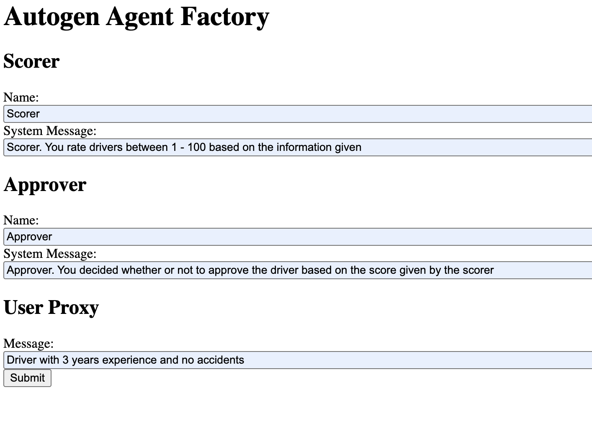

Setup your .env with the correct values for MODEL_NAME and  API_KEY for your LLM server.  

Navigate to http://localhost:8000/ to interact with the app.  
 
Input Agent system messages and User proxy message like the example seen below.
 
